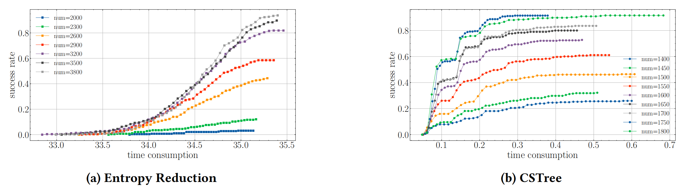

# 📝 Selected Publications 

Under review

[Collision Spanning Tree: Quick Key Recovery for Side-Channel Collision Attacks] \\
<b>Shi Yan, Aisha Tu, Chen Ling, Changhai Ou, Yukun Cheng. Under review 

- Abstract: Benefiting from collision information, collision based side-channel key recovery tools like Correlation-enhanced Collision Attack (CECA), can quickly eliminate erroneous key candidates, enabling more efficient key recovery. However, the existing side-channel collision tools still face with slow collision detection speed and low utilization of collision information. To tackle this, dispersion of correlation coefficients of each collision in CECA is used to detect positions with best ranking of collision values, which are the most favorable for key recovery. We then build a Collision Spanning Tree (CSTree) on these collision positions and exploit circuits check to check the satisfiability of collision conditions during tree creation. Experiments results on AES-128 well illustrate the superiority of our scheme.

